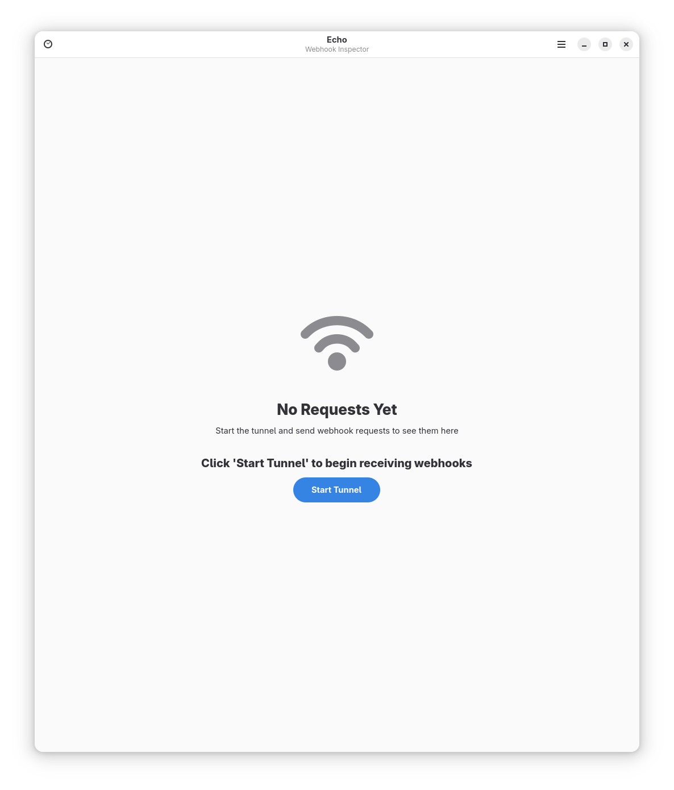
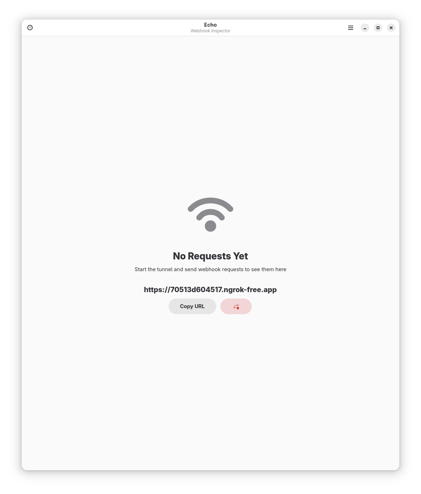
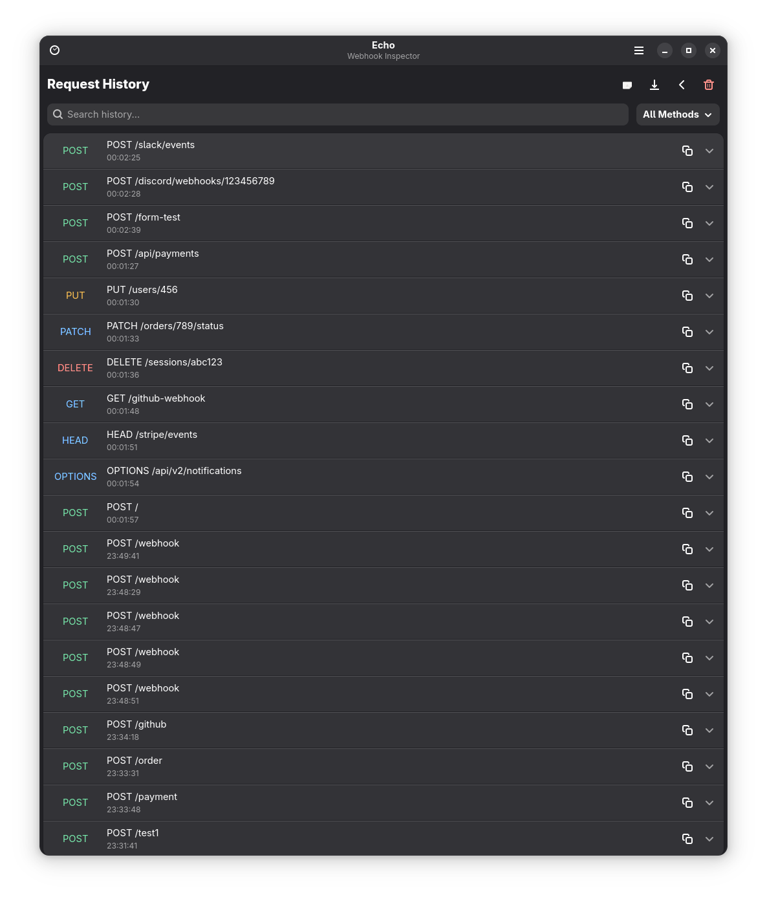
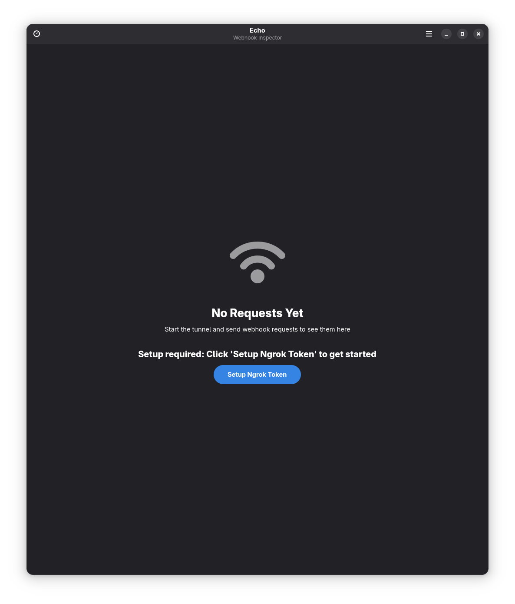

# Sonar

**A modern desktop webhook inspector for developers**

Sonar is a native GTK4 application that provides a beautiful, intuitive interface for capturing and inspecting webhook requests during development. Built with modern technologies and following GNOME design patterns, Sonar makes webhook debugging simple and efficient.


## ✨ Features

- **🔗 Instant Public URLs**: Generate public URLs via ngrok integration for webhook testing
- **📡 Real-time Capture**: Live display of incoming webhook requests as they arrive
- **🔍 Detailed Inspection**: View headers, body content, query parameters, and metadata
- **📋 Quick Copy**: One-click copying of request data, headers, or body content
- **🎯 Accordion UI**: Focus on one request at a time with automatic expansion behavior
- **⚡ Fast & Lightweight**: Native GTK4 application with minimal resource usage
- **🎨 Modern Design**: Clean Libadwaita interface that integrates perfectly with GNOME
- **🔒 Secure**: Runs sandboxed via Flatpak with minimal required permissions

## 🚀 Installation

### Flatpak (Recommended)

```bash
# Install from Flathub (coming soon)
flatpak install flathub io.github.tobagin.sonar

# Or build locally
git clone https://github.com/tobagin/sonar.git
cd sonar
./build.sh --dev --install
```

### From Source

**Requirements:**
- Python 3.12+
- GTK4 development libraries
- Libadwaita 1.4+
- Meson build system
- Blueprint compiler

```bash
git clone https://github.com/tobagin/sonar.git
cd sonar
meson setup builddir
meson compile -C builddir
meson install -C builddir
```

## 🔧 Setup

### 1. Install ngrok (Required)

Sonar uses ngrok to create public URLs for webhook testing:

```bash
# Download from https://ngrok.com/download
# Or use package manager:
snap install ngrok          # Ubuntu/Debian
brew install ngrok/ngrok/ngrok  # macOS
```

### 2. Configure ngrok Auth Token

1. Sign up at [ngrok.com](https://ngrok.com) (free account available)
2. Get your auth token from the dashboard
3. Launch Sonar and click "Setup Ngrok Token" to configure

## 📖 Usage

### Basic Workflow

1. **Start Sonar** - Launch the application from your app menu or terminal
2. **Start Tunnel** - Click "Start Tunnel" to create a public URL
3. **Configure Webhook** - Copy the public URL and configure it in your webhook provider
4. **Inspect Requests** - View incoming webhooks in real-time with full details

### Keyboard Shortcuts

- `Ctrl+Q` - Quit application
- `Ctrl+L` - Clear all requests  
- `Ctrl+,` - Open preferences
- `Ctrl+C` - Copy selected request data (when request is focused)

### Request Details

Each webhook request shows:
- **Method & Path** - HTTP method and endpoint path
- **Timestamp** - When the request was received
- **Headers** - All HTTP headers with copy functionality
- **Body** - Request body with JSON formatting when applicable
- **Content Type** - MIME type of the request
- **Query Parameters** - URL query string parameters

### Copy Functionality

- **Copy All** - Complete request data as JSON
- **Copy Headers** - Just the headers in HTTP format
- **Copy Body** - Just the request body content
- **Copy URL** - The public ngrok URL

## 📸 Screenshots

| Main Window | Tunnel Started | Received Requests |
|-------------|----------------|-------------------|
|  |  |  |

| History View | Setup Required | About Dialog |
|-------------|----------------|-------------|
|  |  |  |

## 🛠️ Development

### Requirements

- Python 3.12+
- PyGObject (GTK4 bindings)
- Dependencies: FastAPI, uvicorn, pydantic, pyngrok, python-dotenv

### Development Setup

```bash
# Clone and setup
git clone https://github.com/tobagin/sonar.git
cd sonar

# Install development dependencies
pip install -e ".[dev]"

# Build for development
./build.sh --dev --install

# Run tests
pytest

# Code quality checks
ruff check src/ tests/
mypy src/
```

### Project Structure

```
sonar/
├── src/                    # Python source code
│   ├── main.py            # Application entry point
│   ├── main_window.py     # Main window implementation
│   ├── models.py          # Data models
│   ├── server.py          # Webhook server
│   ├── tunnel.py          # Ngrok tunnel management
│   └── preferences.py     # Settings dialog
├── data/                   # Application data
│   ├── ui/                # Blueprint UI definitions
│   ├── icons/             # Application icons
│   └── resources/         # GResource definitions
├── tests/                  # Test suite
├── packaging/              # Flatpak manifests
└── po/                     # Internationalization
```

### Building UI

Sonar uses Blueprint for UI definition:

```bash
# Compile Blueprint files
blueprint-compiler batch-compile data/ui/ data/ui/ data/ui/*.blp

# Or use the build script
./build.sh --dev
```

## 🤝 Contributing

Contributions are welcome! Please see our [Contributing Guide](CONTRIBUTING.md) for details.

### Reporting Issues

- **Bugs**: Use the [bug report template](.github/ISSUE_TEMPLATE/bug_report.md)
- **Features**: Use the [feature request template](.github/ISSUE_TEMPLATE/feature_request.md)
- **Questions**: Start a [discussion](https://github.com/tobagin/sonar/discussions)

### Development Guidelines

- Follow PEP 8 for Python code
- Use type hints for all functions
- Write tests for new functionality
- Update documentation for user-facing changes
- Test your changes on different distributions

## 📄 License

Sonar is licensed under the [GNU General Public License v3.0](LICENSE).

## 🙏 Acknowledgments

- [ngrok](https://ngrok.com) for providing the tunneling service
- [GNOME](https://gnome.org) for the excellent GTK4 and Libadwaita frameworks
- [Blueprint](https://gitlab.gnome.org/jwestman/blueprint-compiler) for the modern UI definition language
- The Python community for the excellent libraries used in this project

## 📞 Support

- **Documentation**: [Wiki](https://github.com/tobagin/sonar/wiki)
- **Issues**: [GitHub Issues](https://github.com/tobagin/sonar/issues)
- **Discussions**: [GitHub Discussions](https://github.com/tobagin/sonar/discussions)
- **Email**: tobagin@example.com

---

**Made with ❤️ for the developer community**